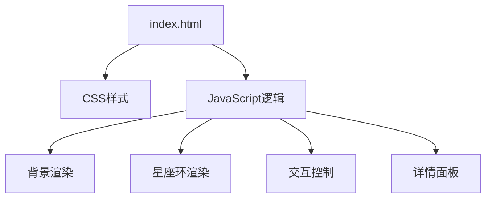

## 1. 架构设计
- 使用纯HTML5原生技术（HTML、CSS、JavaScript）构建
- 不依赖第三方框架，使用Canvas绘制3D效果
- 单页面应用架构
- 模块化JavaScript代码结构



## 2. 技术描述
- **前端**: 纯HTML5 + CSS3 + Vanilla JavaScript
- **3D渲染**: 使用Canvas 2D实现透视效果的3D环形
- **物理引擎**: 手动实现简单的惯性物理效果
- **动画**: CSS动画 + JavaScript requestAnimationFrame

## 3. 数据结构
### 十二星座数据结构
```javascript
const zodiacConstellations = [
  {
    id: 'aries',
    nameCn: '白羊座',
    nameLat: 'Aries',
    symbol: '♈',
    period: '3月21日 - 4月19日',
    element: '火象星座',
    rulingPlanet: '火星',
    stars: [
      { nameCn: '娄宿三', x: 0, y: 0 },
      { nameCn: '娄宿一', x: 1, y: 1 },
      // ... 更多星星
    ],
    intro: '白羊座的简介...',
    meaning: '白羊座的寓意...'
  },
  // ... 其他11个星座
];
```

## 4. 主要功能实现
1. **银河背景**: 使用Canvas绘制渐变效果，动态平移
2. **星空效果**: 随机生成星星，使用正弦波实现闪烁动画
3. **3D星座环**: 利用2D透视投影实现3D效果
4. **旋转交互**: 鼠标/触摸事件监听，计算旋转角度
5. **惯性效果**: 速度衰减算法，自然减速
6. **详情面板**: 半透明边框，响应式定位
7. **星座放大**: CSS transform缩放动画

## 5. 核心渲染逻辑
- 使用requestAnimationFrame实现流畅动画
- 3D坐标到2D屏幕的透视投影计算
- 响应式布局适配不同屏幕尺寸
