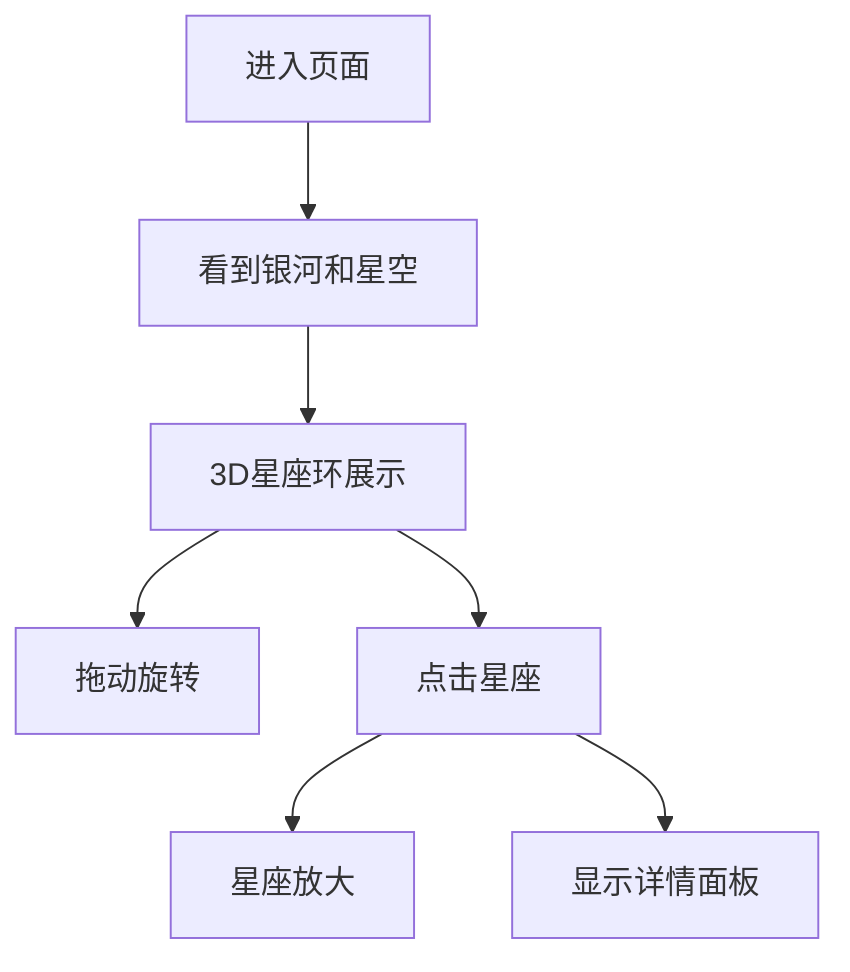

## 1. 产品概述
- 一个展示黄道十二星座的精美3D交互式网页
- 目标是为用户提供沉浸式的星座学习和观赏体验
- 主要功能包括3D环形展示、旋转交互、星座详情查看
- 产品价值在于将天文知识以美观的视觉方式呈现

## 2. 核心功能

### 2.1 用户角色
| 角色 | 注册方式 | 核心权限 |
|------|---------|---------|
| 访客用户 | 无需注册 | 浏览、交互、查看星座信息 |

### 2.2 功能模块
1. **主页面**: 银河背景、星空效果、3D星座环形展示
2. **交互系统**: 鼠标拖动旋转、惯性物理效果
3. **详情展示**: 左侧透明信息框、星座放大效果

### 2.3 页面详情
| 页面名称 | 模块名称 | 功能描述 |
|---------|---------|---------|
| 主页面 | 银河背景 | 动态银河从左至右划过天际的效果 |
| 主页面 | 星空效果 | 随机分布的星星，有忽明忽暗的闪烁动画 |
| 主页面 | 3D星座环 | 12个星座排列成3D扁环形，可旋转 |
| 主页面 | 旋转交互 | 鼠标拖动旋转，带惯性物理效果 |
| 主页面 | 星座点击 | 点击星座后放大，并在左侧显示详细信息 |
| 主页面 | 详情面板 | 半透明边框，显示星座名称、符号、主要星星、简介和寓意 |

## 3. 核心流程
- 用户进入页面 → 看到银河和星空背景 → 12星座环形展示
- 用户可拖动环形旋转 → 停止拖动后有惯性减速效果
- 用户点击任意星座 → 星座放大 → 左侧显示详细信息
- 页面自适应不同屏幕尺寸

## 4. 用户界面设计

### 4.1 设计风格
- **主色调**: 深蓝色夜空背景，配合暖黄色文字
- **装饰风格**: 神秘的星空氛围，银河渐变背景
- **字体**: 中文使用标宋体，英文使用Times New Roman
- **交互风格**: 平滑的动画过渡，自然的物理效果

### 4.2 页面设计概述
| 页面名称 | 模块名称 | UI元素 |
|---------|---------|--------|
| 主页面 | 银河背景 | 深色渐变，动态移动的银河效果 |
| 主页面 | 星空背景 | 随机星星，闪烁动画 |
| 主页面 | 3D星座环 | 12个星座图标 + 文字标签，3D旋转 |
| 主页面 | 详情面板 | 半透明边框，黄白文字，左侧定位 |

### 4.3 响应式
- 桌面端完整展示
- 移动端自适应缩放，确保详情面板和星座环不重叠
- 触摸设备支持

### 4.4 3D场景
- **环境/氛围**: 夜空背景，银河效果，星星闪烁
- **光照**: 柔和的星光效果
- **相机设置**: 初始视角正对星座环
- **交互**: 鼠标拖动旋转，惯性物理效果
- **构图**: 星座环居中，详情面板在左侧
